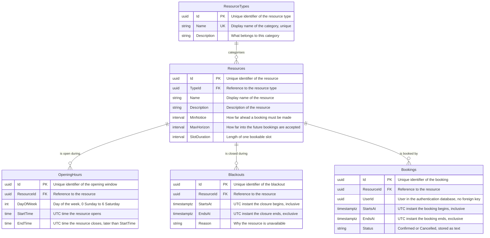
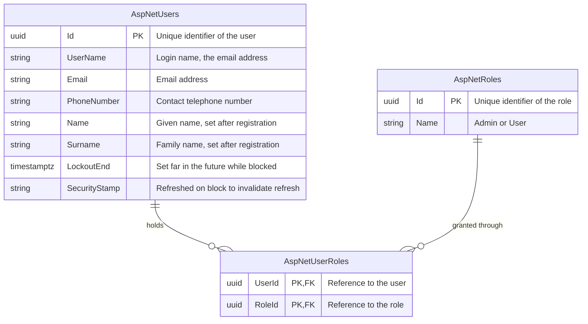

# Entity relationships

## Booking database

Deleting a `Resource` cascades to its opening hours, blackouts and bookings. Deleting a
`ResourceType` is restricted while any resource still references it.

There are no navigation properties on the model types — the relationships above exist in the
database only, expressed in code as plain `Guid` columns.

## Authentication database

Standard ASP.NET Core Identity schema (`AspNetUsers`, `AspNetRoles`, `AspNetUserRoles`,
`AspNetUserClaims`, `AspNetRoleClaims`, `AspNetUserLogins`, `AspNetUserTokens`), keyed by `uuid`.

`Bookings.UserId` refers to `AspNetUsers.Id` across the database boundary, so it is an identifier
rather than a foreign key.
